<h3><code>utkarshsoni1@github ~ $ ./contributions.sh</code></h3>

 
 

<h3><code>utkarshsoni1@github ~ $ whoami</code></h3>

<h3><code>utkarshsoni1@github ~ $ Tech Stack</code></h3>

    

<h3><code>utkarshsoni1@github ~ $ ./links.sh</code></h3>

<b>Fullstack Developer · AI Builder · Instructor</b>

 

