# UTKARSH SONI

<h3><code>utkarshsoni1@github ~ $ ./contributions.sh</code></h3>

 
 

<h3><code>utkarshsoni1@github ~ $ whoami</code></h3>

<h3><code>utkarshsoni1@github ~ $ Tech Stack</code></h3>
<!-- 

    

 -->
    
<table >
  <tr>
    <td align="left"><b>Languages</b></td>
    <td align="left"></td>
  </tr>
  <tr>
    <td align="left"><b>Frontend</b></td>
    <td align="left"></td>
  </tr>
  <tr>
    <td align="left"><b>Backend & APIs</b></td>
    <td align="left"></td>
  </tr>
  <tr>
    <td align="left"><b>Databases & ORMs</b></td>
    <td align="left"></td>
  </tr>
  <tr>
    <td align="left"><b>AI / ML</b></td>
    <td align="left"></td>
  </tr>
  <tr>
    <td align="left"><b>Cloud & DevOps</b></td>
    <td align="left"></td>
  </tr>
  <tr>
    <td align="left"><b>Tools & Utilities</b></td>
    <td align="left"></td>
  </tr>
</table>

  

  
  

<!-- ============================================= -->
<!-- 🧩 PROJECTS — Bento Grid (HTML table method) -->
<!-- Paste this block into your profile README.md -->
<!-- ============================================= -->

<h3><code>utkarshsoni1@github ~ $ ./Projects.sh</code></h3>

<table width="100%">
  <tr>
    <td width="100%" colspan="2" valign="top">
      <h3>🏠 <a href="https://github.com/UtkarshSoni1/stayz">StayZ</a></h3>
      <i>Find your vibe. Find your place.</i>  
      Modern room-rental platform built for bachelors and Gen Z renters — mobile-first search, honest reviews, and a full booking-request pipeline instead of bloated forms. Includes an admin analytics suite and owner/user dashboards.
        
      
      
      
      
      
    </td>
  </tr>
  <tr>
    <td width="50%" valign="top">
      <h3>🎨 <a href="https://github.com/UtkarshSoni1/draftspace">DraftSpace</a></h3>
      Draw. Generate. Collaborate.  
      AI-powered collaborative whiteboard where drawing and AI assistance share one canvas — type <code>{ ai: }</code>, <code>{ img: }</code>, or <code>{ code: }</code> anywhere and get an inline response. Real-time multi-user sync, no account required to start drawing.
        
      
      
      
      
      
    </td>
    <td width="50%" valign="top">
      <h3>🧭 <a href="https://github.com/UtkarshSoni1/Ikigai4Teens">Ikigai4Teens</a></h3>
      AI-guided career discovery for teens.  
      Full-stack app that helps teenagers explore interests and match them to career directions through guided AI chat, with persistent per-user history and JWT-based auth.
        
      
      
      
      
    </td>
  </tr>
  <tr>
    <td width="50%" valign="top">
      <h3>🛍️ <a href="https://github.com/UtkarshSoni1/Shyne">Shyne</a></h3>
      🚧 active development  
      Full-stack e-commerce app where shop owners upload products and users browse and interact with them — admin dashboard, custom per-product color themes, and JWT/cookie-based auth.
        
      
      
      
      
      
    </td>
    <td width="50%" valign="top">
      <h3>🖥️ <a href="https://github.com/UtkarshSoni1/userCreate">userCreate</a></h3>
      <a href="https://usercreate-wose.onrender.com">🔗 live demo</a>  
      Full-stack social posting app — sign up, log in, and share posts with likes and public/self profile pages. Server-rendered with EJS, session + JWT auth, image uploads via Multer.
        
      
      
      
      
    </td>
  </tr>
</table>

<!-- ============================================= -->
<!-- To add a new project card:
     - Single card: copy one <td width="50%">...</td> block
     - Full-width hero card: copy the first <tr> block (colspan="2")
     - Keep pairs of <td> inside one <tr> for even 2-column rows
-->

<h3><code>utkarshsoni1@github ~ $ ./links.sh</code></h3>

<b>Fullstack Developer · AI Enthusiast · Perfectionist</b>

 

